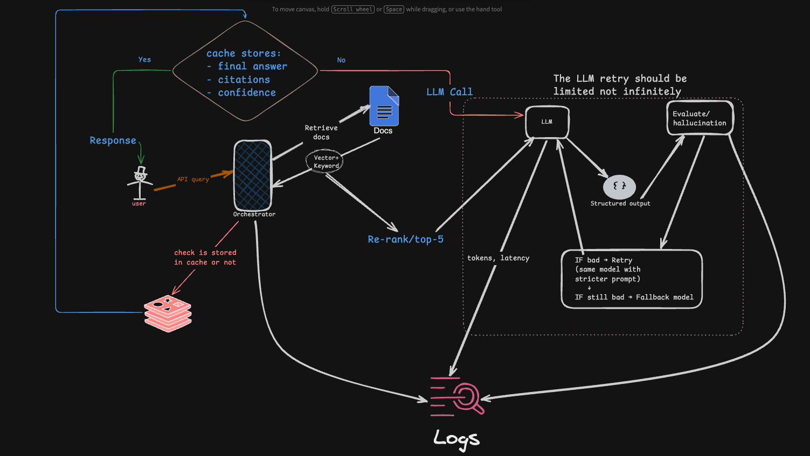

# 🧠 AI Research Agent — Evaluation-Driven RAG System

A production-style AI system that answers research queries using retrieval + LLMs, with built-in evaluation, retry logic, and full observability.

---

## 🚀 Overview

This system is not a basic RAG demo.

It is a **controlled LLM pipeline** that:

* Retrieves relevant documents using hybrid search
* Generates structured responses with citations
* Evaluates output quality (hallucination, relevance)
* Automatically retries or falls back when responses are poor
* Tracks latency, cost, and failure points per request

---

## ⚙️ System Architecture

```
Client → API → Orchestrator
                ↓
        Cache (Redis)
         ↓ (miss)
   Retrieval (Qdrant + BM25)
         ↓
      Reranker
         ↓
        LLM
         ↓
 Structured Output (JSON)
         ↓
     Evaluation Layer
         ↓
  Retry / Fallback Logic
         ↓
   Logs + Metrics (Postgres)
         ↓
       Response
```
---



## 🧩 Key Features

### 1. Hybrid Retrieval

* Vector search (Qdrant)
* Keyword search (BM25)
* Combined + reranked results (top-k filtering)

---

### 2. Controlled LLM Generation

* Structured JSON output (answer + citations + confidence)
* Schema validation + retry on failure

---

### 3. Evaluation System (Core Differentiator)

* Rule-based checks (format, citations)
* LLM-as-judge scoring:

  * faithfulness
  * relevance
  * hallucination detection

---

### 4. Retry + Fallback Strategy

* Retry with stricter prompt
* Reduce noisy context
* Fallback to alternate model
* Max retry limit enforced

---

### 5. Caching Layer

* Redis-based query caching
* Reduces latency + cost
* Cache key: `hash(query + tenant_id)`

---

### 6. Observability & Tracing

Each request generates a `trace_id` with:

```json
{
  "trace_id": "abc123",
  "steps": [
    { "step": "retrieval", "latency_ms": 120 },
    { "step": "generation", "tokens": 1100 },
    { "step": "evaluation", "score": 0.82 }
  ]
}
```

---

### 7. Cost Tracking

* Token usage per request
* Cost per request
* Aggregated metrics

---

## 🛠️ Tech Stack

* **Backend:** Node.js + TypeScript
* **Vector DB:** Qdrant
* **Database:** PostgreSQL
* **Cache:** Redis
* **LLMs:**

  * Primary: Gemini
  * Fallback: OpenAI / Claude

---

## 📡 API Endpoints

### `POST /query`

```json
{
  "query": "What are recent advances in RAG?",
  "user_id": "u1",
  "tenant_id": "t1"
}
```

Response:

```json
{
  "answer": "...",
  "citations": ["doc1", "doc2"],
  "confidence": 0.87,
  "trace_id": "abc123"
}
```

---

### `GET /trace/:id`

Returns full execution trace

---

### `GET /metrics`

Returns aggregated:

* latency
* cost
* eval scores

---

## 🔁 Failure Handling

| Failure          | Cause             | Solution                       |
| ---------------- | ----------------- | ------------------------------ |
| Bad retrieval    | irrelevant docs   | hybrid search + rerank         |
| Hallucination    | weak grounding    | eval + retry + stricter prompt |
| Invalid JSON     | LLM inconsistency | schema validation + retry      |
| High latency     | large context     | caching + top-k limit          |
| Cost spikes      | retries           | fallback model + limits        |
| Context overflow | too many tokens   | chunking + truncation          |

---

## 📊 Sample Metrics

```
Latency: 2.1s → 1.2s (after caching)
Hallucination rate: 18% → 6%
Cost/request: $0.01 → $0.003
```

---

## 🧠 Design Philosophy

> “Do not trust the LLM — verify, correct, and control it.”

This system treats LLMs as:

* non-deterministic
* error-prone
* expensive

And wraps them with:

* evaluation
* retries
* observability

---

## 🔮 Future Improvements

* Cross-encoder reranking
* Semantic caching
* Feedback loop from users
* Offline evaluation dataset
* Multi-tenant isolation improvements

---

## 🎯 Why This Project Matters

Most RAG systems:

* generate answers
* hope they are correct

This system:

* **verifies correctness**
* **handles failures**
* **tracks performance**

👉 Built to reflect real-world AI production systems.

---

## 🧪 How to Run

```bash
# install deps
bun install

# run server
bun run dev
```
